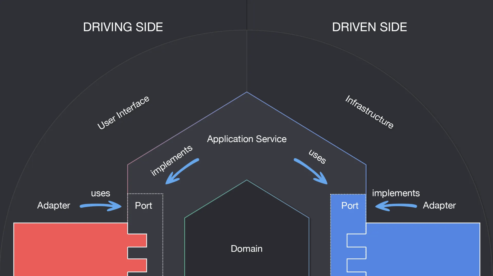
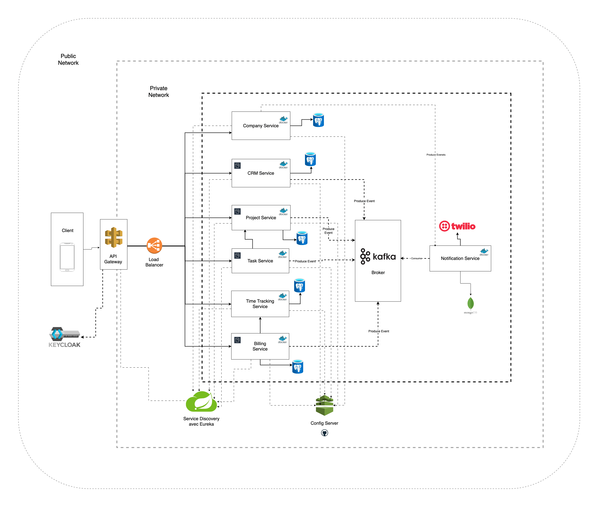

# 🚀 Prolance — Plateforme SaaS Multi-Tenant de Gestion de Projets

## 📌 Présentation

**Prolance** est une plateforme SaaS multi-tenant conçue pour permettre aux entreprises de gérer efficacement leurs clients, projets, tâches, équipes et facturation dans un environnement centralisé, sécurisé et évolutif.

Chaque entreprise (tenant) dispose d’un espace isolé avec ses propres utilisateurs, données et configurations, garantissant ainsi la sécurité et la confidentialité des informations.

Le système est construit en utilisant une **architecture microservices** combinée avec une **architecture hexagonale (Ports & Adapters)** afin d’assurer une forte maintenabilité, une évolutivité optimale et une séparation claire des responsabilités.

---

# 🏗️ Architecture

## 🔹 Architecture Microservices

Le système est découpé en plusieurs services indépendants, chacun responsable d’un domaine métier spécifique.

### Avantages :

* Déploiement indépendant des services
* Scalabilité fine (par service)
* Isolation des pannes
* Maintenance facilitée
* Séparation claire des domaines métier

---

## 🔹 Architecture Hexagonale (Ports & Adapters)

Chaque microservice est conçu selon l’architecture hexagonale, permettant de séparer :

* La logique métier (Domain)
* Les cas d’usage (Application)
* Les dépendances techniques (Infrastructure)

### Avantages :

* Indépendance vis-à-vis des frameworks
* Testabilité améliorée
* Évolution facile des composants techniques
* Code métier propre et isolé

---

# 🧩 Diagrammes d’architecture

## Architecture Hexagonale



---

## Diagramme des Microservices



---

# ⚙️ Technologies utilisées

## Backend

* Java 17
* Spring Boot
* Spring Web MVC
* Spring Data JPA
* Spring Security

## API Gateway

* Spring Cloud Gateway (WebFlux)

## Authentification & Sécurité

* Keycloak
* JWT (JSON Web Tokens)

## Résilience & Tolérance aux pannes

* **Resilience4j**

    * Circuit Breaker
    * Retry
    * Rate Limiter
    * Time Limiter

👉 Utilisé pour :

* protéger les appels inter-services
* éviter les cascades de pannes
* améliorer la stabilité globale du système

## Base de données

* PostgreSQL
* Une base de données par microservice

## Architecture & Design

* Microservices
* Architecture Hexagonale
* Domain-Driven Design (DDD)
* Event-Driven Architecture

## Outils & DevOps

* Maven
* Docker
* Git / GitHub

---

# 🏢 Multi-Tenancy

Prolance est conçu comme une application **multi-tenant**, ce qui signifie que :

* Chaque entreprise possède ses propres données
* Les utilisateurs sont isolés par entreprise
* Les accès sont contrôlés par tenant
* Aucune fuite de données entre entreprises n’est possible

L’isolation est assurée par :

* les tokens JWT
* l’identifiant du tenant (`tenant_id`)
* des validations au niveau des services

---

# 🔐 Authentification & Autorisation

Le système utilise **Keycloak** pour :

* Gérer les utilisateurs
* Authentifier les connexions
* Gérer les rôles et groupes
* Générer des tokens JWT sécurisés

---

# 🧱 Services du système

## 🔹 Company Service

Responsable de la gestion des entreprises (tenants).

### Fonctionnalités :

* Création d’entreprise
* Gestion des paramètres
* Gestion des utilisateurs
* Attribution des rôles
* Synchronisation avec Keycloak

---

## 🔹 CRM Service

Responsable de la gestion des relations clients et du processus commercial.

### Fonctionnalités :

* Gestion des leads
* Gestion des opportunités
* Gestion des clients
* Gestion des contacts
* Suivi du pipeline commercial

### Workflow :

Lead → Opportunité → Gagnée / Perdue

---

## 🔹 Project Service

Responsable de la gestion du cycle de vie des projets.

### Fonctionnalités :

* Création de projet
* Gestion des jalons
* Suivi de l’état du projet
* Affectation des équipes

### Workflow :

Création → Planification → Actif → Terminé

---

## 🔹 Task Service

Responsable de l’exécution opérationnelle.

### Fonctionnalités :

* Gestion des tâches
* Sous-tâches
* Assignation des utilisateurs
* Dépendances entre tâches
* Suivi de l’avancement

### Workflow :

À faire → En cours → Revue → Terminé

---

## 🔹 Billing Service

Responsable de la gestion de la facturation.

### Fonctionnalités :

* Génération de factures
* Gestion des lignes de facture
* Suivi des factures
* Association aux projets

> ⚠️ Le paiement n’est pas inclus dans cette version.

---

## 🔹 Notification Service

Responsable de la communication interne.

### Fonctionnalités :

* Notifications de tâches
* Alertes système
* Notifications d’événements

---

# 📡 Communication entre services

Les services communiquent via :

* API REST (communication synchrone)
* Événements internes (Event-Driven Architecture)

---

# 🔄 Gestion des transactions distribuées

Prolance implémente le **pattern Saga** pour gérer les transactions distribuées entre microservices.

## Approches utilisées :

### 🔹 Chorégraphie

* Les services réagissent à des événements
* Pas de coordinateur central
* Faible couplage

### 🔹 Orchestration

* Un service orchestre le workflow
* Contrôle explicite des étapes
* Meilleure visibilité du flux

👉 Le choix entre chorégraphie et orchestration dépend du **contexte métier et de la complexité du workflow**.

---

# 🎯 Objectifs du projet

* Construire une plateforme SaaS scalable
* Assurer une isolation complète des tenants
* Fournir une architecture maintenable
* Implémenter des patterns robustes (Saga, Résilience)
* Préparer le système à une montée en charge future

---

# 📂 Structure du projet

Chaque service suit :

```text
src
├── domain
├── application
└── infrastructure
```

---

# 🔥 Améliorations futures

* Intégration Kafka (Event Streaming)
* Notifications en temps réel
* Reporting avancé
* CI/CD complet
* Déploiement Kubernetes
* Analyse intelligente (IA)

---

# 👨‍💻 Auteur

Projet développé par Ali Yara.

---
